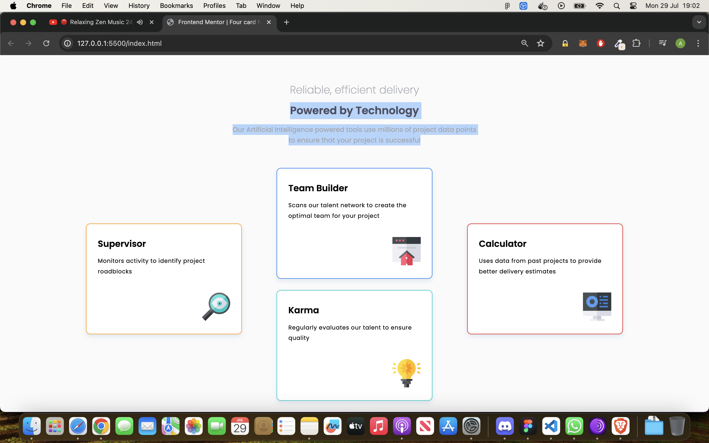

# Frontend Mentor - Four card feature section solution

This is a solution to the [Four card feature section challenge on Frontend Mentor](https://www.frontendmentor.io/challenges/four-card-feature-section-weK1eFYK). Frontend Mentor challenges help you improve your coding skills by building realistic projects. 

## Table of contents

- [Overview](#overview)
  - [The challenge](#the-challenge)
  - [Screenshot](#screenshot)
  - [Links](#links)
- [My process](#my-process)
  - [Built with](#built-with)
  - [What I learned](#what-i-learned)
  - [Continued development](#continued-development)

## Overview

### The challenge

Users should be able to:

- View the optimal layout for the site depending on their device's screen size

### Screenshot




### Links

- Solution URL: [https://github.com/Sharky83/four-card-feature-section](https://github.com/Sharky83/four-card-feature-section)
- Live Site URL: [https://four-card-feature-section-rho-one.vercel.app/](https://four-card-feature-section-rho-one.vercel.app/)

## My process

### Built with

- HTML5 markup
- CSS custom properties
- Flexbox
- CSS Grid
- Mobile-first workflow

**Note: These are just examples. Delete this note and replace the list above with your own choices**

### What I learned

Learned a lot regarding responsiveness and mixing flex and grid and a new css property (last of type)


```css
.proud-of-this-css {
  .card:nth-last-of-type(1)
}
```

### Continued development

keep going over the web.dev site, and Kevin Powell youtube tutorials.

